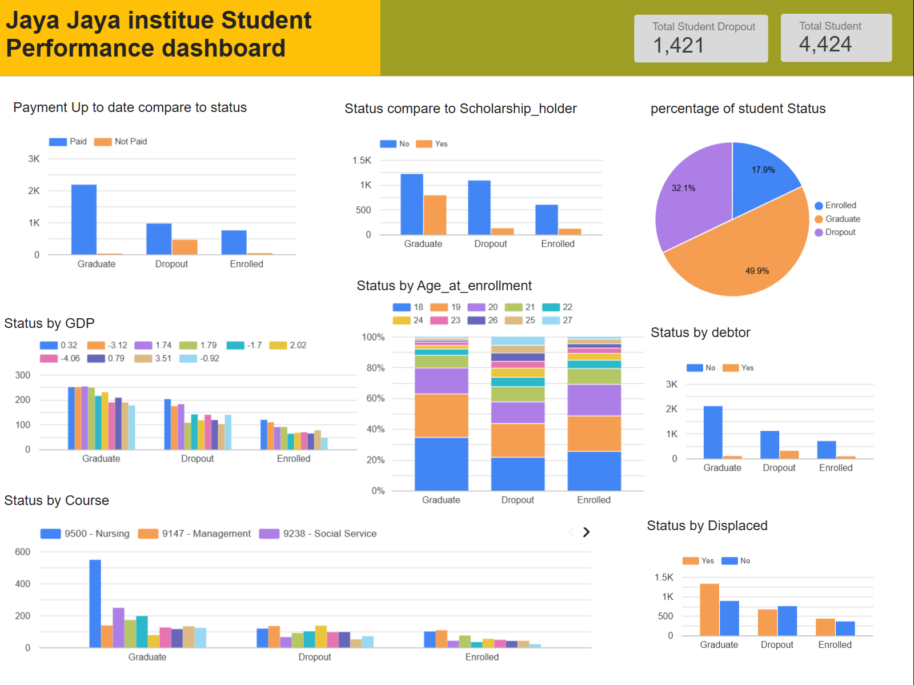

# Proyek Akhir: Menyelesaikan Permasalahan Perusahaan Edutech

## Business Understanding

Jaya Jaya Institut adalah sebuah institusi pendidikan yang berdiri sejak tahun 2000. Institut ini telah mencetak banyak lulusan dengan reputasi yang sangat baik di dunia pendidikan. Namun, ada tantangan besar yang dihadapi, yakni jumlah siswa yang tidak menyelesaikan pendidikannya, atau biasa disebut dengan "dropout". 

Tingginya tingkat dropout ini menjadi masalah serius bagi institusi tersebut karena berpotensi memengaruhi stabilitas finansial dan reputasi akademik institut. Oleh karena itu, Jaya Jaya Institut ingin mengidentifikasi mahasiswa yang berisiko untuk drop out sesegera mungkin agar bisa diberikan bimbingan dan intervensi yang tepat sebelum mereka meninggalkan pendidikan mereka.


### Permasalahan Bisnis

Permasalahan bisnis utama yang akan diselesaikan adalah:
-  **Tingkat Dropout Tinggi**: Banyaknya mahasiswa yang tidak melanjutkan pendidikan mereka hingga lulus menyebabkan kerugian finansial bagi institusi.
- **Risiko Reputasi**: Dropout yang tinggi dapat memengaruhi reputasi Jaya Jaya Institut di kalangan masyarakat dan calon mahasiswa.
- **Welfare Mahasiswa**: Mahasiswa yang mengalami dropout mungkin menghadapi masalah pribadi atau akademik yang dapat diatasi dengan bimbingan yang lebih baik.
- **Pengembangan Sistem Monitoring Komprehensif**: Untuk mendukung keputusan strategis yang lebih baik, institusi membutuhkan implementasi sistem monitoring yang mampu melacak tren dan faktor-faktor terkait dropout secara real-time.
  
### Cakupan Proyek

Cakupan proyek ini meliputi:
- **Eksplorasi Data (EDA)**: Melakukan analisis eksploratif untuk mengidentifikasi pola-pola yang ada dalam data yang dapat memengaruhi keputusan untuk dropout.
- **Pengembangan Model Prediktif dan Pengujian Model**: Mengembangkan tiga model machine learning (XGBoost, LightGBM, dan Gradient Boosting) untuk memprediksi status mahasiswa (dropout atau tidak) dan memilih model dengan akurasi tertinggi dengan fokus pada akurasi identifikasi faktor pemicu.
- **Evaluasi Model**: Model yang dipilih akan dievaluasi menggunakan metrik akurasi, precision, recall, dan confusion matrix.
- **Visualisasi Hasil**: Membuat dashboard untuk visualisasi hasil analisis data dan memudahkan pemangku kepentingan dalam mengambil keputusan berdasarkan data.
- **Desain Dashboard yang Informatif**: Merancang dan mengimplementasikan dasbor visual informatif yang berfungsi sebagai alat monitoring berkelanjutan untuk tingkat putus kuliah, identifikasi faktor kunci, dan pelacakan tren historis nantinya.


### Persiapan

Sumber data: [Dataset Dicoding](https://github.com/dicodingacademy/dicoding_dataset/tree/main/students_performance)

#### **Setup Environment**

#### Menyiapkan Lingkungan untuk Menjalankan Jupyter Notebook (.ipynb) di Google Colab dan VS Code

#### 1. Menjalankan Jupyter Notebook di Google Colab

Google Colab adalah platform online yang memungkinkan Anda menjalankan Jupyter Notebooks di cloud tanpa perlu pengaturan pada mesin lokal.

##### Panduan Langkah demi Langkah:
1. **Buka Google Colab**:
   - Kunjungi [Google Colab](https://colab.research.google.com/).

2. **Unggah Notebook Anda**:
   - Klik **File** di menu kiri atas.
   - Pilih **Upload notebook**.
   - Pilih file `.ipynb` dari mesin lokal Anda dan klik **Open**.

3. **Jalankan Notebook Anda**:
   - Setelah diunggah, notebook Anda akan terbuka di antarmuka Colab.
   - Anda dapat menjalankan sel notebook dengan memilih kode di dalamnya dan menekan **Shift + Enter** atau mengklik tombol play di samping sel tersebut.

4. **Menggunakan Google Drive (Opsional)**:
   - Jika file notebook Anda disimpan di Google Drive, Anda juga bisa membuka notebook langsung dari Google Drive.
   - Klik **File > Open notebook**, kemudian pilih tab **Google Drive** untuk memilih notebook dari drive Anda.

---

#### 2. Menjalankan Jupyter Notebook di VS Code

Untuk menjalankan Jupyter Notebook di **mesin lokal** menggunakan **VS Code**, Anda perlu menginstal beberapa alat, seperti **Python**, **Jupyter**, dan **VS Code Jupyter extension**.

##### Panduan Langkah demi Langkah:
1. **Instal VS Code**:
   - Jika Anda belum menginstal **VS Code**, unduh dan pasang dari [sini](https://code.visualstudio.com/Download).

2. **Instal Python**:
   - Pastikan Anda sudah menginstal **Python** di sistem Anda. Anda bisa mengunduhnya dari [sini](https://www.python.org/downloads/).
   - Setelah instalasi, periksa apakah Python terinstal dengan benar dengan menjalankan `python --version` di terminal atau command prompt.

3. **Instal Jupyter**:
   - Buka terminal atau command prompt dan instal Jupyter Notebook dengan menjalankan:
     ```bash
     pip install notebook
     ```
   - Ini akan menginstal Jupyter dan membuatnya tersedia untuk digunakan.

4. **Instal Jupyter Extension di VS Code**:
   - Buka **VS Code**.
   - Pergi ke **Extensions** dengan mengklik ikon Extensions di sidebar (atau tekan `Ctrl + Shift + X`).
   - Cari **"Jupyter"** dan instal **Jupyter extension** dari Microsoft.

5. **Instal Python Extension di VS Code**:
   - Cari **Python** extension di Extensions view.
   - Instal **Python extension** dari Microsoft untuk mendukung Python di VS Code.

6. **Buka Jupyter Notebook**:
   - Buka file `.ipynb` langsung di VS Code dengan memilih **File > Open File** atau drag dan drop notebook ke VS Code.
   - VS Code akan secara otomatis mendeteksi format notebook dan menampilkannya dalam editor yang mendukung Jupyter.

7. **Pilih Python Interpreter**:
   - Jika diminta, pilih interpreter Python yang ingin Anda gunakan dengan mengklik nama kernel di pojok kanan atas dan memilih interpreter yang sesuai. Pastikan Anda telah menginstal **Jupyter** di lingkungan yang dipilih.

8. **Jalankan Notebook**:
   - Setelah lingkungan diatur, Anda dapat menjalankan sel-sel dengan memilih kode dan menekan **Shift + Enter**, atau menggunakan tombol play.

---

## Business Dashboard

Dashboard ini dirancang untuk menyajikan wawasan mendalam mengenai status dropout mahasiswa. Dengan menampilkan metrik utama, tren, dan perbandingan berdasarkan beragam faktor pemicu yang teridentifikasi dari analisis, dashboard ini bertujuan membantu pihak institut dalam mengidentifikasi area fokus strategis untuk meningkatkan motivasi dan keberhasilan studi mahasiswa.

🔗 URL Lookerstudio: [Jaya Jaya institue Student Performance dashboard](https://lookerstudio.google.com/reporting/0113074f-0ad4-4a57-900b-810672fbcd43)



## Menjalankan Prototype Sistem Machine Learning

.png)
.png)
.png)
.png)


Prototype ini digunakan dengan cara meninput manual. Adapun cara menjalankannya terbagi menjadi dua yaitu secara lokal dan online.

Cara secara lokal:
Berikut adalah langkah-langkah untuk menyiapkan lingkungan pengembangan (environment) dan menjalankan aplikasi **Streamlit** (`app.py`) yang diambil dari repository GitHub berikut:  
[https://github.com/ThirafiQaedi/dicoding_penerapan_datascience2](https://github.com/ThirafiQaedi/dicoding_penerapan_datascience2)

## 1. Persiapkan Lingkungan Virtual
Buat lingkungan virtual untuk mengisolasi dependensi aplikasi agar tidak bentrok dengan proyek lain.

```bash
# Membuat environment virtual
python -m venv myenv

# Mengaktifkan environment
# Untuk Windows
myenv\Scripts\activate

# Untuk macOS/Linux
source myenv/bin/activate
```
## 2. Instalasi Dependensi
Clone repository dan install semua dependensi yang diperlukan oleh aplikasi.

### Langkah-langkah:
1. **Clone repository**:
   Clone repository GitHub yang berisi aplikasi dengan menjalankan perintah berikut di terminal:
   ```bash
   git clone https://github.com/ThirafiQaedi/dicoding_penerapan_datascience2.git
   ```

2. **Masuk ke folder proyek**:
   Setelah repository berhasil di-clone, pindah ke direktori proyek dengan perintah berikut:
   ```bash
   cd dicoding_penerapan_datascience2
   ```

3. **Install dependensi**:
   Jika proyek menyediakan file `requirements.txt`, Anda bisa menginstal semua dependensi yang diperlukan dengan perintah:
   ```bash
   pip install -r requirements.txt
   ```
   Ini akan menginstal semua paket Python yang dibutuhkan untuk menjalankan aplikasi.

4. **Jika tidak ada `requirements.txt`**:
   Jika proyek tidak menyertakan `requirements.txt`, Anda bisa menginstal dependensi secara manual. Misalnya, untuk aplikasi Streamlit, Anda harus menginstal Streamlit, Pandas, dan dependensi lainnya:
   ```bash
   pip install streamlit pandas numpy matplotlib seaborn scikit-learn
   ```

---

## 3. Jalankan Aplikasi Streamlit
Setelah semua dependensi diinstal, Anda dapat menjalankan aplikasi **Streamlit** dengan perintah berikut.

### Langkah-langkah:
1. **Jalankan aplikasi**:
   Untuk memulai aplikasi Streamlit, gunakan perintah:
   ```bash
   streamlit run app.py
   ```
   
   Perintah ini akan memulai aplikasi Streamlit pada `localhost`, dan Anda bisa mengaksesnya melalui browser dengan URL seperti:
   ```
   http://localhost:8501
   ```

2. **Buka aplikasi di browser**:
   Setelah menjalankan perintah di atas, aplikasi akan otomatis terbuka di browser. Jika tidak terbuka secara otomatis, Anda bisa membuka browser dan mengetikkan `http://localhost:8501`.

---

## 4. Periksa Kode dalam `app.py`
Pastikan kode dalam file `app.py` tidak mengandung kesalahan dan sesuai dengan struktur yang diharapkan. Berikut langkah-langkah yang perlu diperhatikan:

### Langkah-langkah:
1. **Periksa file `app.py`**:
   Pastikan bahwa file `app.py` tidak mengandung kesalahan atau missing dependencies. Jika ada error yang muncul setelah menjalankan aplikasi, periksa apakah semua pustaka yang dibutuhkan sudah diimpor dengan benar.

2. **Cek dependensi**:
   Jika aplikasi menggunakan data atau file eksternal (seperti CSV, Excel, atau model terlatih), pastikan bahwa file tersebut ada di folder yang sesuai dengan kode.

3. **Menangani kesalahan**:
   Jika ada kesalahan dalam aplikasi, Anda bisa memeriksa pesan error yang muncul di terminal dan menyesuaikan kode di `app.py` untuk memperbaiki masalah tersebut.

---

Untuk versi onlinenya dapat di lihat dilink streamlit cloud berikut : 

https://dicodingpenerapandatascience2-kew3kwbaqbbbr9gy3fdfom.streamlit.app/

## Conclusion

Proyek ini berhasil melakukan analisis komprehensif terhadap data performa mahasiswa Jaya Jaya Institut dengan tujuan untuk mengidentifikasi faktor-faktor yang mempengaruhi status dropout. Melalui eksplorasi data yang mendalam dan penerapan model prediktif seperti XGBoost, LightGBM, dan Gradient Boosting, proyek ini berhasil mengungkap pola-pola signifikan yang dapat digunakan untuk mendeteksi mahasiswa berisiko dropout.

### A. Profil Demografi & Latar Belakang Mahasiswa:
- **Usia & Nilai Awal**: Mahasiswa yang berisiko dropout memiliki rata-rata usia saat pendaftaran sekitar 26 tahun, dengan nilai akademik awal yang bervariasi, menunjukkan bahwa dropout tidak hanya terjadi pada mahasiswa dengan usia muda atau nilai rendah.
- **Jenis Kelamin**: Proporsi mahasiswa yang dropout antara perempuan dan laki-laki hampir seimbang, yang menunjukkan bahwa faktor gender tidak memiliki pengaruh signifikan terhadap tingkat dropout.
- **Status Perkawinan**: Mayoritas mahasiswa yang dropout berstatus lajang, yang dapat mengindikasikan bahwa mereka memiliki prioritas yang berbeda dibandingkan mahasiswa yang sudah menikah dan mungkin lebih fokus pada pendidikan mereka.
- **Latar Belakang Pendidikan Orang Tua**: Banyak mahasiswa yang dropout berasal dari latar belakang keluarga dengan orang tua yang memiliki pendidikan di tingkat Menengah atau lebih rendah dan bekerja di sektor pekerjaan tidak terampil. Ini mengindikasikan adanya faktor sosial-ekonomi yang dapat mempengaruhi keputusan mahasiswa untuk keluar dari institusi.
  
### B. Faktor Keuangan & Dukungan Institusional:
- **Biaya Kuliah**: Sebagian besar mahasiswa yang dropout belum membayar biaya kuliah mereka tepat waktu. Ini menunjukkan adanya masalah keuangan yang signifikan sebagai faktor pendorong dropout.
- **Beasiswa**: Mayoritas mahasiswa yang dropout bukan penerima beasiswa. Ini menunjukkan bahwa dukungan finansial melalui beasiswa sangat penting untuk membantu mahasiswa tetap bertahan dalam pendidikan mereka.
- **Status Debitur**: Meskipun sebagian besar mahasiswa yang dropout tidak memiliki status debitur, ada kelompok yang memiliki utang yang menunjukkan bahwa masalah finansial lebih dalam turut berkontribusi pada keputusan untuk berhenti kuliah.
- **Displaced (Mahasiswa yang Terpisah dari Keluarga)**: Mahasiswa yang terpisah dari keluarga atau tidak tinggal di tempat asalnya menunjukkan tingkat dropout yang lebih tinggi, mengindikasikan adanya kesulitan adaptasi atau kurangnya dukungan sosial yang dapat memengaruhi keputusan untuk dropout.

### C. Hasil Prediktif:
- **Model Prediksi Terbaik**: Dari tiga model yang diuji (XGBoost, LightGBM, dan Gradient Boosting), model **Gradient Boosting** menunjukkan performa terbaik dengan akurasi sebesar **86,44%**. Model ini berhasil mengidentifikasi mahasiswa yang berisiko dropout dengan tingkat akurasi yang tinggi, memberikan dasar yang kuat bagi institusi untuk melakukan intervensi dini.

Proyek ini memberikan wawasan penting yang dapat digunakan untuk merancang kebijakan dan program intervensi yang lebih tepat sasaran dalam mengurangi tingkat dropout di Jaya Jaya Institut.


### Rekomendasi Action Items (Optional)

1. **Intervensi Finansial & Dukungan Ekonomi:**
   - **Sistem Peringatan Dini Tunggakan Biaya Kuliah**: Implementasikan sistem otomatis yang memberikan peringatan dini kepada mahasiswa dan/atau pembimbing/wali jika ada keterlambatan pembayaran biaya kuliah, diikuti dengan penawaran solusi atau bantuan (misalnya, cicilan, penundaan, atau informasi beasiswa).
   - **Peningkatan Program Beasiswa & Bantuan Keuangan**: Perluas cakupan dan jenis beasiswa (terutama beasiswa berbasis kebutuhan) atau program bantuan keuangan lainnya, mengingat mayoritas mahasiswa yang dropout bukan penerima beasiswa dan banyak yang memiliki tunggakan biaya kuliah.
   - **Konseling Keuangan**: Sediakan layanan konseling keuangan bagi mahasiswa untuk membantu mereka mengelola anggaran, memahami opsi pinjaman pendidikan, dan mencari sumber pendanaan tambahan, terutama bagi mereka yang teridentifikasi sebagai debitur.

2. **Dukungan Adaptasi & Kesejahteraan Mahasiswa:**
   - **Program Adaptasi untuk Mahasiswa Lajang & Displaced**: Kembangkan program orientasi atau komunitas yang lebih terfokus untuk mahasiswa lajang dan mereka yang "displaced" (jauh dari rumah/keluarga). Ini bisa berupa grup dukungan, kegiatan sosial, atau fasilitas tempat tinggal yang terjangkau.
   - **Dukungan Psikososial Terpadu**: Perkuat layanan konseling dan dukungan mental/emosional. Mahasiswa dengan usia rata-rata 26 tahun yang dropout mungkin menghadapi tekanan hidup yang lebih kompleks di luar akademik, sehingga membutuhkan dukungan yang lebih komprehensif.
   - **Program Mentoring Khusus**: Pertimbangkan program mentoring di mana mahasiswa senior atau staf pengajar dapat membimbing mahasiswa baru atau mereka dari latar belakang pendidikan/pekerjaan orang tua yang kurang menguntungkan, membantu mereka menavigasi tantangan akademik dan sosial.

3. **Tinjauan Kurikulum & Dukungan Akademik Khusus Program Studi:**
   - **Evaluasi Program Studi dengan Angka Dropout Tinggi**: Lakukan evaluasi menyeluruh terhadap kurikulum, metode pengajaran, beban kerja, dan peluang karier di program studi seperti Manajemen yang memiliki tingkat dropout tinggi. Identifikasi titik-titik kesulitan spesifik.
   - **Sistem Peringatan Dini Keterlibatan Akademik**: Kembangkan sistem untuk memonitor keterlibatan mahasiswa pada unit mata kuliah, terutama jika terdapat "unit tanpa evaluasi". Ini bisa menjadi indikator awal masalah akademik atau motivasi, dan memungkinkan intervensi lebih awal seperti konseling akademik atau tutorial.
   - **Dukungan Akademik Terpersonalisasi**: Tawarkan dukungan akademik tambahan (tutorial, bimbingan belajar) untuk mata kuliah-mata kuliah yang seringkali menyebabkan unit tanpa evaluasi atau nilai rendah di kalangan mahasiswa dropout.

4. **Optimalisasi Proses Pendaftaran & Orientasi:**
   - **Evaluasi Jalur Aplikasi Berisiko Tinggi**: Tinjau proses penerimaan dan orientasi untuk mahasiswa yang mendaftar melalui mode "Over 23 years old" dan "1st phase - general contingent". Pastikan ekspektasi mereka terkelola dengan baik dan mereka mendapatkan dukungan adaptasi yang memadai sejak awal.
   - **Program Retensi Awal**: Pertimbangkan program retensi yang difokuskan pada bulan-bulan atau semester pertama bagi kelompok-kelompok berisiko tinggi yang teridentifikasi dari mode aplikasi atau status pembayaran yang terlambat.

5. **Pemantauan Berkelanjutan & Pengambilan Keputusan Berbasis Data:**
   - **Pembentukan Tim Retensi**: Bentuk tim lintas departemen (HR, Kemahasiswaan, Akademik, Keuangan) yang secara rutin meninjau dashboard dan menginterpretasikan data untuk mengidentifikasi mahasiswa berisiko. Tim ini bisa bekerja sama dalam merancang program intervensi.
   - **Pengembangan Protokol Intervensi**: Buat protokol yang jelas tentang jenis intervensi apa yang harus dilakukan ketika seorang mahasiswa teridentifikasi berisiko dropout (misalnya, panggilan dari pembimbing akademik, penawaran konseling, atau bantuan keuangan).
   - **Iterasi Model & Dashboard**: Lakukan pembaruan data dan evaluasi model serta dashboard secara berkala (misalnya, setiap semester) untuk memastikan relevansi dan akurasinya seiring waktu, mengingat kemungkinan adanya perubahan tren atau faktor pemicu yang baru.


## Acknowledgements
- Realinho,Valentim, Vieira Martins,Mónica, Machado,Jorge, and Baptista,Luís. (2021). Predict students' dropout and academic success. UCI Machine Learning Repository. https://doi.org/10.24432/C5MC89.
- Dicoding. (n.d.). *Students' Performance Dataset*. Diunduh dari https://github.com/dicodingacademy/dicoding_dataset/tree/main/students_performance 
